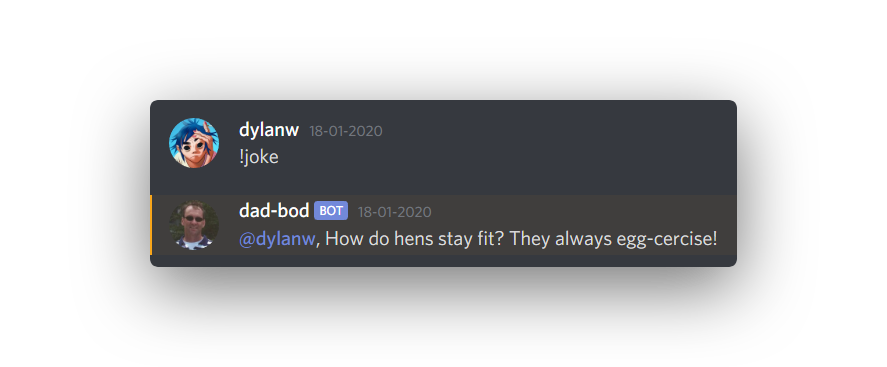

# dad-bot
 A fun little project that I made with Node.JS
 
## Functions
 When the bot is online you can type the command `!joke` which will pull a joke from https://icanhazdadjoke.com/ and display it in the chat like so:

