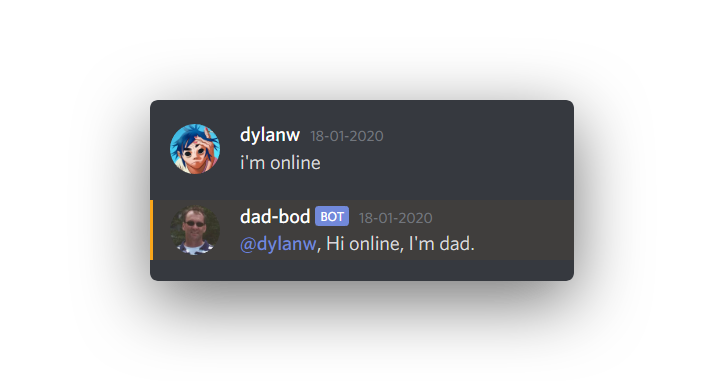

# dad-bot
 I was messing around with Node.js for a while until a friend challenged me to create a Discord bot. I had seen such a thing come by ones and decided to take on the challenge, so here is a fun little project that I made with Node.JS, the icanhazdadjoke API and the node fetch module.
 
[Invite the bot](https://discord.com/oauth2/authorize?client_id=655543688658944011&scope=bot&permissions=3072)
 
## Functions
 When the bot is online you can type the command `!joke` which will pull a joke from https://icanhazdadjoke.com/ and display it in the chat like so:
 

 When someone types a string containing I'm or alike it will produce the typical `Hey blank I'm Dad` joke.
 
